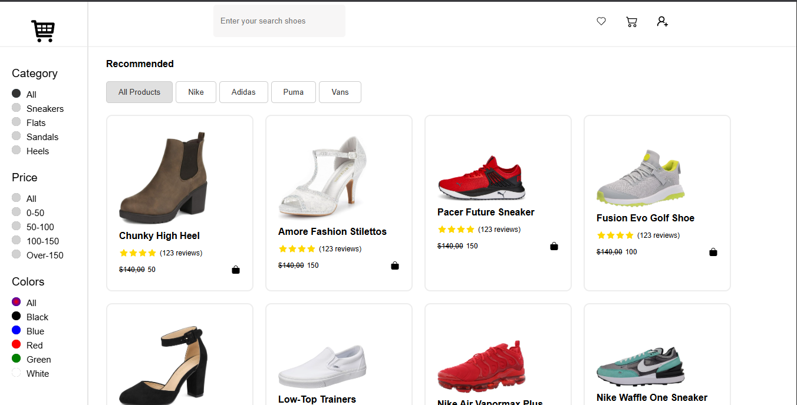
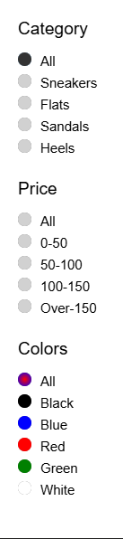

# SoleFilter


A clean full-stack shoe discovery app where users can search products and narrow results instantly by brand, category, color, and price. The project is built with a React + Vite frontend and an Express + MongoDB backend that returns filtered shoe data through query-based API requests.

## Overview

This project is a practical MERN filtering app focused on:

- building reusable UI filters
- connecting a frontend to a query-driven backend
- structuring product data with MongoDB and Mongoose
- rendering responsive product cards from live API results

It is a compact full-stack project that demonstrates state-driven UI filtering, API integration, and MongoDB query construction in one repo.

## Features

- Live search by shoe title
- Filter products by brand
- Filter products by category
- Filter products by color
- Filter products by price range
- Loading state while fetching products
- Empty state when no matching items are found
- MongoDB-powered product retrieval through Express routes

## Tech Stack

- Frontend: React, Vite, Axios, React Icons
- Backend: Node.js, Express, Mongoose, dotenv, CORS
- Database: MongoDB

## Project Structure

```text
SoleFilter/
|-- Backend/
|   |-- server.js
|   |-- Routes/
|   |   `-- routes.js
|   |-- Databse/
|   |   |-- connectdb.js
|   |   |-- data.js
|   |   `-- Model and Schema/
|   |       |-- ShoeSchema.js
|   |       `-- shoeModel.js
|   `-- package.json
|-- Frontend/
|   |-- src/
|   |   |-- api/
|   |   |-- Components/
|   |   |-- Content/
|   |   |-- Navbar/
|   |   |-- Recommended/
|   |   `-- Sidebar/
|   `-- package.json
`-- README.md
```

## User Experience

The UI is centered around a product listing page with:

- a top search bar for shoe names
- a sidebar for category, price, and color filters
- a recommended brand selector for fast product narrowing
- a product grid that updates from backend responses
- loading and empty states for better feedback

## Preview

### Home Page



### Filter Results



## API

Base route:

```http
GET /shoe
```

Supported query parameters:

- `title` - matches shoe title with case-insensitive search
- `company` - filters by brand
- `category` - filters by category
- `color` - filters by color
- `price` - filters by ranges such as `0-50`, `50-100`, `100-150`, or `Over-150`

Example:

```http
GET http://localhost:8000/shoe?title=nike&company=Nike&color=black&category=sneakers&price=100-150
```

## Local Development

### Prerequisites

- Node.js
- npm
- MongoDB connection string

## Quick Start

### 1. Clone the project

```bash
git clone <your-repository-url>
cd solefilter
```

### 2. Install dependencies

Backend:

```bash
cd Backend
npm install
```

Frontend:

```bash
cd Frontend
npm install
```

## Environment Variables

Create `Backend/.env`:

```env
DATABASE_URL=your_mongodb_connection_string
```

Create `Frontend/.env`:

```env
VITE_API_URL=http://localhost:8000
```

## Run the App

Use two terminals.

Start the backend:

```bash
cd Backend
npm start
```

Start the frontend:

```bash
cd Frontend
npm run dev
```

Then open the Vite dev URL shown in the terminal, typically:

```text
http://localhost:5173
```

## Available Scripts

Backend:

- `npm start` - runs the Express server
- `npm run dev` - intended to run the backend with nodemon

Frontend:

- `npm run dev` - starts the Vite development server
- `npm run build` - creates a production build
- `npm run preview` - previews the production build
- `npm run lint` - runs ESLint

## Data Model

Each shoe document includes:

- `img`
- `title`
- `reviews`
- `prevPrice`
- `newPrice`
- `company`
- `color`
- `category`

Sample data for development lives in:

- `Backend/Databse/Model and Schema/shoeModel.js`
- `Backend/Databse/data.js`

## Configuration Notes

- The backend currently runs on port `8000`
- The frontend reads the backend URL from `VITE_API_URL`
- The backend source currently uses the folder name `Databse`

## Why This Project Stands Out

- It shows full-stack integration instead of only static UI work
- The filtering logic is practical and easy to explain in interviews
- The app demonstrates API query handling with multiple filter combinations
- The structure is simple enough to extend with auth, sorting, pagination, or admin features

## Possible Improvements

- Add sorting by price, popularity, or newest
- Add pagination or infinite scrolling
- Add backend validation for query parameters
- Add a dedicated seeding command
- Add product details pages
- Improve error handling for failed API requests
- Add tests for API filters and frontend interactions

## Contributing

Contributions, suggestions, and improvements are welcome. If you plan to extend the app, a good next step is adding sorting, pagination, product detail pages, or deployment configuration.
